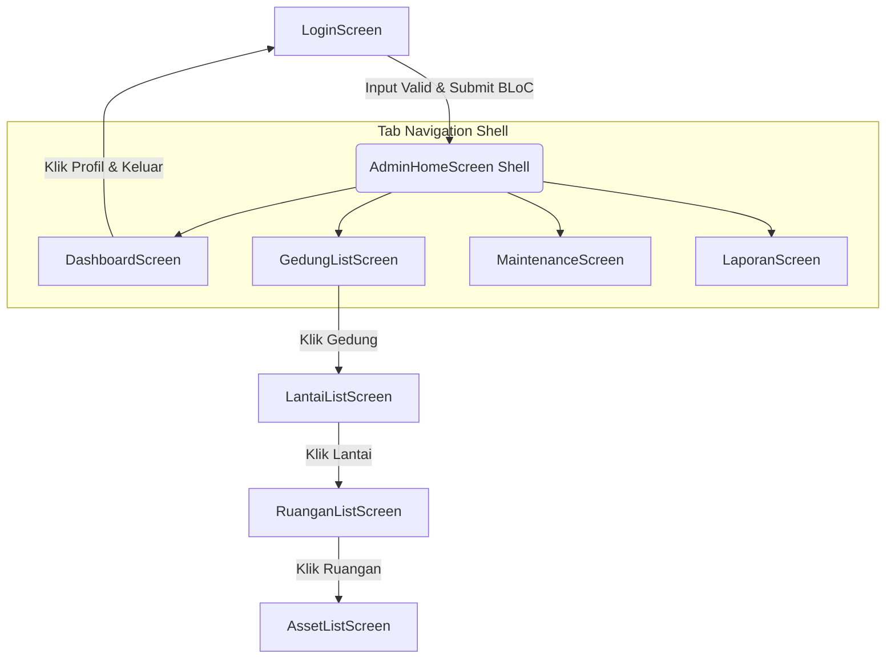

# LAPORAN PENGEMBANGAN APLIKASI: FOM (Facilities Office Management)
**Tugas Proyek Akhir - Mobile Computing**

---

## 1. Daftar Halaman dan Aliran Pengguna (User Flow)

Aplikasi **FOM (Facilities Office Management)** memiliki total **8 halaman/layar utama** yang terbagi dalam alur otentikasi, modul dashboard navigasi utama, dan alur detail penelusuran aset gedung.

### Daftar Halaman
| No | Nama Halaman | Kelas Dart | Deskripsi / Fungsi Utama |
|----|--------------|------------|---------------------------|
| 1  | Halaman Login | `LoginScreen` | Pintu masuk autentikasi pengguna menggunakan email dan password (dikelola oleh `AuthBloc`). |
| 2  | Halaman Utama Shell | `AdminHomeScreen` | Wadah navigasi bawah (Bottom Navigation Bar) yang memuat `IndexedStack` untuk 4 tab utama admin. |
| 3  | Tab Dashboard | `DashboardScreen` | Statistik ringkas aset/gedung, visualisasi chart pai status aset (`fl_chart`), daftar tugas terbaru, dan Live System Activity Log (`StreamBuilder`). |
| 4  | Tab Daftar Gedung | `GedungListScreen` | Daftar seluruh gedung kantor yang diload secara asinkronus menggunakan `FutureBuilder`. |
| 5  | Tab Maintenance | `MaintenanceScreen` | Daftar jadwal dan riwayat perawatan fasilitas kantor. |
| 6  | Tab Laporan Aduan | `LaporanScreen` | Pengelolaan daftar aduan kerusakan fasilitas yang masuk dari karyawan. |
| 7  | Detail Lantai Gedung | `LantaiListScreen` | Menampilkan daftar lantai di dalam gedung yang dipilih dari `GedungListScreen`. |
| 8  | Detail Ruangan Lantai | `RuanganListScreen` | Menampilkan daftar ruangan dari lantai yang dipilih di `LantaiListScreen`. |
| 9  | Detail Aset Ruangan | `AssetListScreen` | Menampilkan seluruh aset (AC, Projector, PC, Kursi, dll.) beserta status kondisinya di ruangan terpilih. |

---

### Aliran Pengguna (User Flow Diagram)

Berikut visualisasi perpindahan halaman (routing/flow) di dalam aplikasi:



---

## 2. Arsitektur Proyek & Penerapan Komponen Mobile Computing

Aplikasi dirancang menggunakan arsitektur **Clean Layered Architecture** yang dikombinasikan dengan State Management **BLoC** (untuk flow kritis seperti Autentikasi) dan **Provider** (untuk data fasilitas).

### Struktur Folder Proyek
```text
lib/
├── blocs/               # Layer Bisnis Logika BLoC
│   └── auth/            # AuthBloc (Event, State, Bloc) untuk Login/Logout
├── models/              # Layer Data Model (Entity)
│   ├── facility_model.dart
│   └── user_model.dart
├── providers/           # Layer State Management Provider (ChangeNotifier)
│   └── facility_provider.dart
├── screens/             # Layer Tampilan (UI)
│   ├── admin/           # Dashboard, Gedung, Lantai, Ruangan, Aset, Laporan, Maintenance
│   └── auth/            # LoginScreen
├── utils/               # Tema Warna Aplikasi & Data Mocking (Dummy)
│   ├── app_theme.dart
│   └── dummy_data.dart
└── main.dart            # Titik awal jalannya aplikasi (Inisialisasi)
```

---

### Penerapan Komponen Mobile Computing yang Dipelajari

#### a. Widget
Semua komponen antarmuka pengguna dibuat menggunakan widget Flutter yang terstruktur baik secara statik (`StatelessWidget`) maupun dinamis (`StatefulWidget`). 
* Contoh: `LoginScreen` menerapkan `StatefulWidget` untuk mengontrol siklus animasi transisi dan teks controller.

#### b. ListView.builder
Digunakan untuk memuat daftar data dalam jumlah besar secara dinamis tanpa membebani memori (lazy loading).
* Diterapkan pada daftar laporan kerusakan di [laporan_screen.dart](file:///Users/user/Documents/Facilities_manajamen/lib/screens/admin/laporan_screen.dart#L163) dan daftar pemeliharaan di [maintenance_screen.dart](file:///Users/user/Documents/Facilities_manajamen/lib/screens/admin/maintenance_screen.dart#L120).

#### c. FutureBuilder (Asinkronus & Loading State)
Digunakan untuk merender widget berdasarkan snapshot interaksi asinkronus (simulasi request fetch data ke Web API).
* Diterapkan pada [gedung_list_screen.dart](file:///Users/user/Documents/Facilities_manajamen/lib/screens/admin/gedung_list_screen.dart) menggunakan fungsi asinkron dengan jeda (delay) 1.5 detik yang di-cache di `initState` agar loading indicator hanya berputar saat pertama kali data diambil.

#### d. StreamBuilder (Real-time Data)
Digunakan untuk mendengarkan aliran data (Stream) secara terus-menerus dan memperbarui UI secara real-time saat ada data baru masuk.
* Diterapkan pada **Live System Activity Log** di [dashboard_screen.dart](file:///Users/user/Documents/Facilities_manajamen/lib/screens/admin/dashboard_screen.dart) yang secara real-time menampilkan log aktivitas sistem yang diperbarui otomatis setiap 4 detik menggunakan stream periodik.

#### e. BLoC (Business Logic Component)
Diterapkan untuk memisahkan logika bisnis dari UI. Aliran data searah (*unidirectional data flow*) diimplementasikan secara ketat menggunakan event dan state.
* Diterapkan pada sistem Autentikasi (`AuthBloc`). State dari login (Loading, Authenticated, Failure) dipantau secara reaktif menggunakan `BlocConsumer` di [login_screen.dart](file:///Users/user/Documents/Facilities_manajamen/lib/screens/auth/login_screen.dart).

#### f. Local Storage (SharedPreferences)
Digunakan untuk menyimpan sesi login secara lokal pada perangkat pengguna agar tidak perlu memasukkan email & password setiap kali aplikasi dibuka (Auto-Login).
* Diterapkan di [auth_bloc.dart](file:///Users/user/Documents/Facilities_manajamen/lib/blocs/auth/auth_bloc.dart) untuk menyimpan email saat login sukses dan menghapusnya saat logout, serta divalidasi saat inisialisasi di [main.dart](file:///Users/user/Documents/Facilities_manajamen/lib/main.dart).

#### g. CRUD Reaktif (Gedung, Ruangan, Aset)
Untuk memfasilitasi peran Admin dalam mengelola fasilitas kantor secara real-time, kami menerapkan CRUD penuh yang terintegrasi secara reaktif dengan State Management `FacilityProvider`.
* Setiap penambahan, pengubahan, atau penghapusan gedung, ruangan, atau aset akan memicu pembaruan UI secara instan (termasuk visualisasi Pie Chart di Dashboard).

---

## 3. Library (Package) yang Digunakan

Berikut adalah daftar library eksternal yang dipasang pada [pubspec.yaml](file:///Users/user/Documents/Facilities_manajamen/pubspec.yaml) beserta kegunaannya masing-masing:

| Nama Package | Versi | Fungsi / Kegunaan Utama di Proyek |
|--------------|-------|----------------------------------|
| `flutter_bloc` | `^8.1.6` | Framework State Management BLoC untuk mengontrol status login, logout, dan penanganan error secara clean dan terpisah dari UI. |
| `provider` | `^6.1.2` | State Management berbasis ChangeNotifier untuk mengelola operasi CRUD data fasilitas (gedung, lantai, ruangan, aset) secara global. |
| `shared_preferences` | `^2.3.2` | Penyimpanan lokal persisten berbasis key-value untuk menyimpan token login/sesi user agar user tidak perlu login ulang saat membuka aplikasi. |
| `fl_chart` | `^0.69.0` | Library grafik premium untuk merender diagram lingkaran (Pie Chart) di halaman Dashboard guna merepresentasikan persentase kondisi aset. |
| `google_fonts` | `^6.2.1` | Mengintegrasikan font kustom dari Google Fonts (seperti Outfit) agar tipografi aplikasi terlihat modern dan profesional. |
| `intl` | `^0.19.0` | Membantu formatting tanggal, jam, dan mata uang sesuai standar lokal bahasa Indonesia. |
